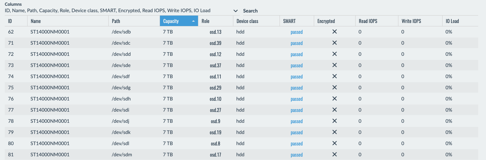
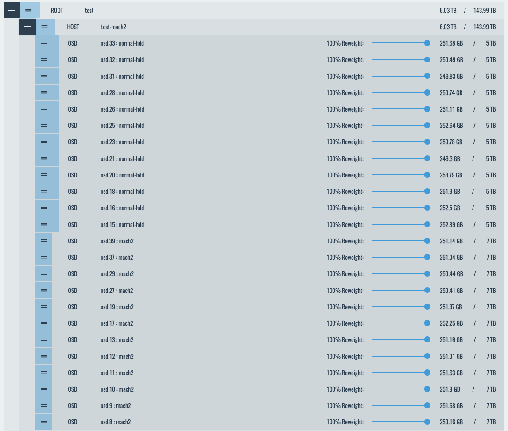
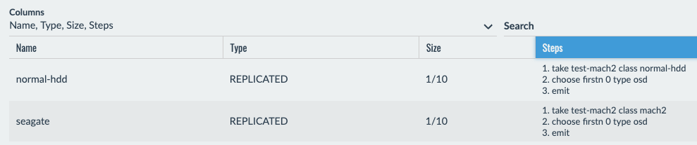
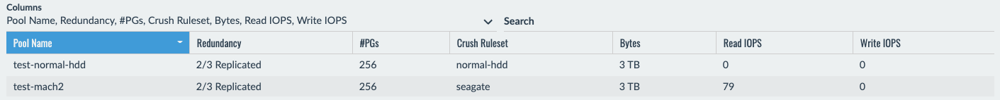
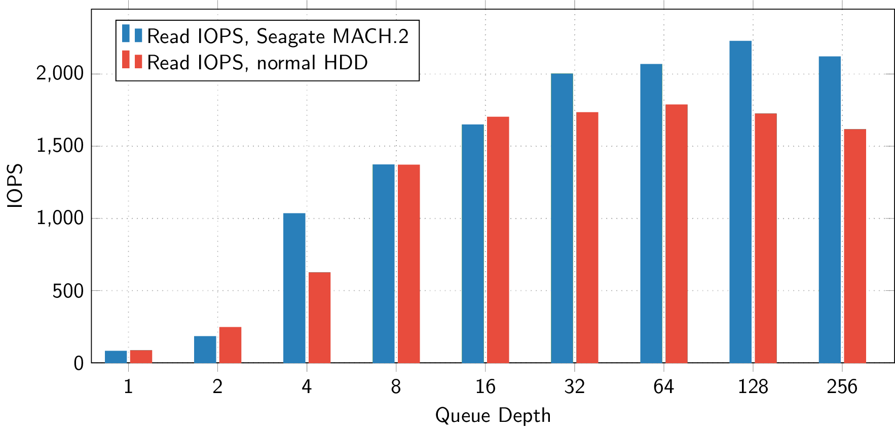
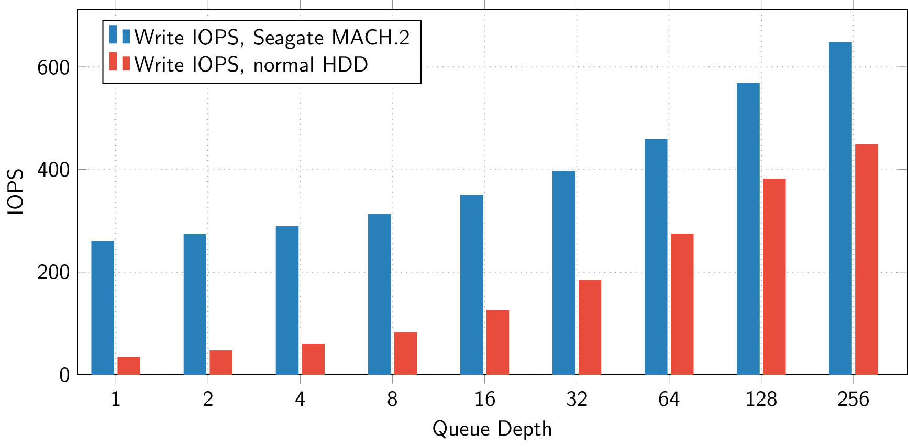
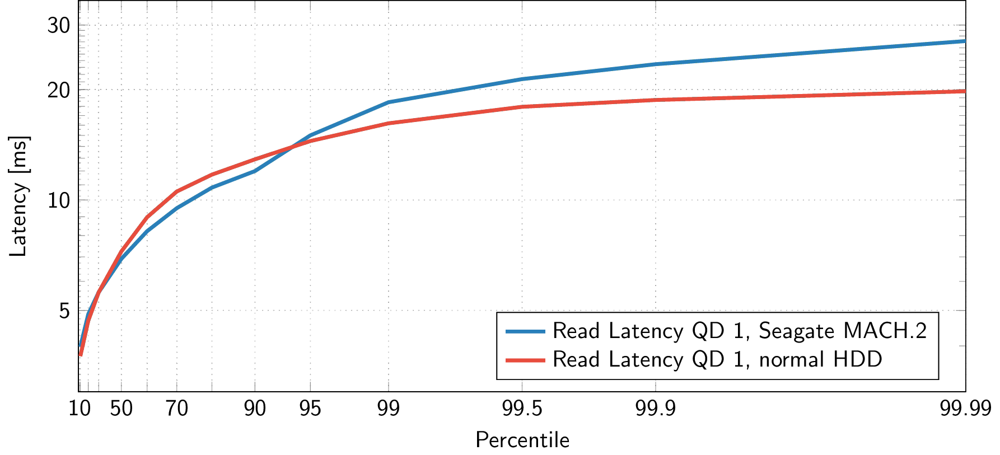
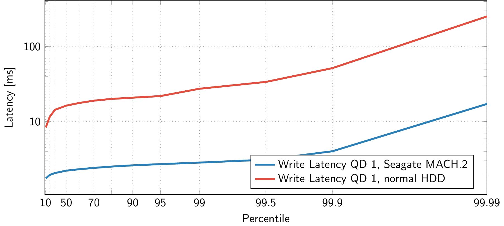
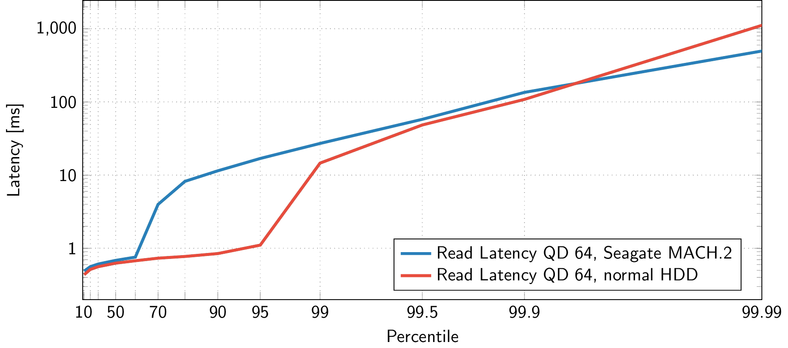
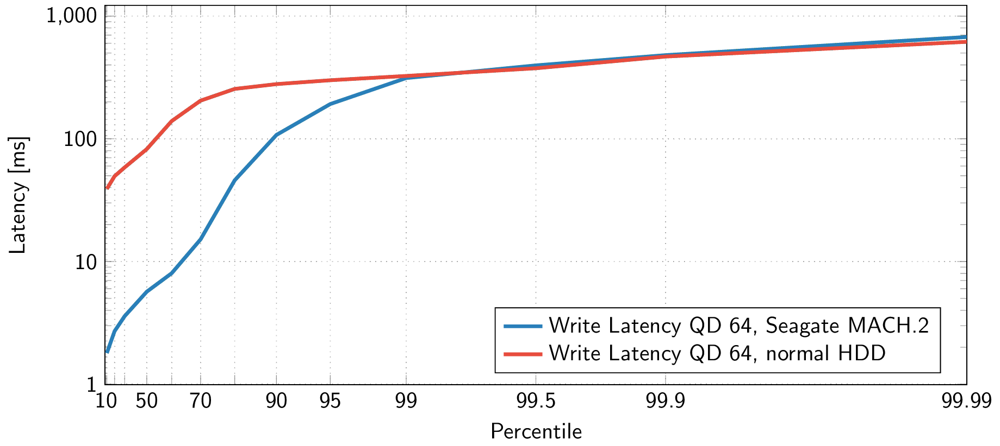

# Benchmarking Seagate Exos2X14 HDDs with MACH.2 technology

Seagate provided us with a few samples of their Exos2X14 Dual Actuator drive (MACH.2) HDDs that will be available in early 2020.
These disks come with two independent sets of read/write heads that show up as two separate disks to the operating system, each with half the total capacity.

What's the point of such a strange disk?
You can get more IOPS out of it compared to a single traditional disk with all read/write heads on a single actuator.

So let's put these disks to the test with Ceph.
 
# Test setup

All tests were run on an otherwise unused test Ceph cluster.

## Hardware

We used two HP ProLiant DL380e Gen8 servers, each equipped with two Xeon E5-2430L CPUs (2 GHz, 6 cores), 128 GB of RAM, a dual-port Broadcom BCM57810 10 Gbit/s NIC, and an LSI SAS2308 SAS controller.
One server was used as a Ceph client running `fio`, the other ran the Ceph OSDs with 6 Seagate ST14000NM0001 Exos2X14 Dual Actuator drive (MACH.2) disks (14 TB, 7200 RPM) and 6 Toshiba MG06SCA disks (10 TB, 7200 RPM).
Note that the SAS controller is an older model running a 6 Gbit/s link speed to the disk (instead of 12 Gbit/s) which may be a bottleneck for sequential operations, but we believe it should not affect Ceph performance by much in the evaluated scenario.

## Software
We ran the croit v1910 enterprise image built on December 10, 2019 featuring Debian 10, kernel 4.19, and Ceph 14.2.5.
All Ceph config settings were set to the [croit](https://croit.io/croit-production-guide) defaults.

The server acting as benchmark client ran the same croit image with fio 3.12.

## Ceph Setup

The classic Toshiba HDDs were partitioned into two LVM LVs to run two OSDs per disk to allow for a fair comparison.
There is a small performance advantage when running multiple OSDs on a single disk in some benchmarks.
The Exos2X14 Dual Actuator drive (MACH.2) disks show up as two separate disks with 7 TB each and are therefore always home to two OSDs.



This means we have a total of 24 OSDs on the server, 12 for each disk type.
Both disk types run two OSDs per physical disk, the Exos2X14 Dual Actuator drive (MACH.2) disks have additional hardware support for such a setup, traditional disks don't.

We then assigned custom device classes in the croit CRUSH map editor.



We also needed some custom CRUSH rules since this is a single-node Ceph, i.e., we need to set the failure domain to OSD.



We then created two replicated pools with the default x3 replication factor and put a 1 TB RBD image in each. Each image was then completely filled with random data for the following benchmarks.



We also enabled the balancer in croit and got a virtually perfect data distribution with 64 PGs on each OSD, this avoids accidentally overloading a single disk in a benchmark.

## Benchmark Tool

We ran fio with the rbd plugin using a 4k block size and a varying IO depth and IO pattern.
The direct flag was set to disable caching. Also, the 1 TB images are larger than the available caches.

Each test was run for 15 minutes to get reliable results, this means the results shown below were acquired during a total of 9 hours running fio.

The used command looks like this:

```
fio --ioengine=rbd --pool=${pool} --rbd=test --direct=1 --bs=4k --numjobs=1 --iodepth=${iodepth} --runtime=900 --time_based --group_reporting --name=test --rw=${rw} --output-format json
```

Actual script is [available on GitHub](https://github.com/croit/benchmarks/blob/master/mach2-disks/benchmark.sh).

# Results: Random Read/Write IOPS



The Exos2X14 Dual Actuator drive (MACH.2) disks perform better than traditional disks at high queue depths, but the difference isn't too big. Reading data is rarely the bottleneck in Ceph, writing usually is.



The difference is more pronounced when writing data: These disks significantly outperform the traditional HDDs, especially at low and medium queue depths.
Traditional disks only start the catch up at unrealistically high queue depths (real-world workloads are rarely above a queue depth of 64).

The main reason is that writing data in Ceph amplifies the latencies of individual disks: a default x3 replication needs to wait for the slowest out of 3 disks.

# Results: Latency

The graphs below show log-log HDR histograms of the latency at different queue depths for the same benchmark runs.
HDR histograms show how many requests (in percent) are handled in less than some time.
For example, a latency (y) value of 10 ms at percentile (x) 99 means that 99% of requests were handled in less than 10 ms, and only 1% took longer than 10 ms.

Note that these results are for the same benchmarks as above, i.e., the Exos2X14 Dual Actuator drive (MACH.2) disks handled more requests during the measurement.


## Queue Depth 1




Like before, the Exos2X14 Dual Actuator drive (MACH.2) disks really shine when handling write workload with a far lower latency while serving more requests. Read tail latency is worse by a few milliseconds.


## Queue Depth 64




The gap begins to close as the queue depth increases. Queue depth 64 is a queue depth often encountered in real-world setups, the Exos2X14 Dual Actuator drive (MACH.2) disks still outperform the traditional disks here for most requests when writing data despite having a higher total IO load on the disk.

# Results: Sequential Read/Write
We can write 431 MB/s sequentially to the RBD with these disks, that's 108 MB/s per OSD and 216 MB/s per physical disk taking the x3 replication overhead into account.
Reading sequentially gets us 590 MB/s (98 MB/s per physical disk), the bottleneck is likely somewhere else here.

These are very nice results for HDDs.


# Conclusions

These new type of disk looks like a promosing way to get more write performance out of traditional spinning HDDs.
There's some management overhead because you have to look out for more OSDs, but a good Ceph management tool such as croit can take care of this.


The raw benchmark data (fio json output) and scripts used to plot these graphs are [available on GitHub](https://github.com/croit/benchmarks).


# Notes

We received the HDDs from Seagate for performance evaluation for free.
All benchmark scenarios and settings were selected by croit without prior involvement from Seagate.
We would like to thank Seagate for the partnership and look forward to further exciting products.
More information about the [Seagate HDDs](https://www.seagate.com/files/www-content/datasheets/pdfs/exos-2x14-DS2015-2-1912US-en_US.pdf) can be found at [seagate.com](https://www.seagate.com/solutions/mach-2-multi-actuator-hard-drive/).

